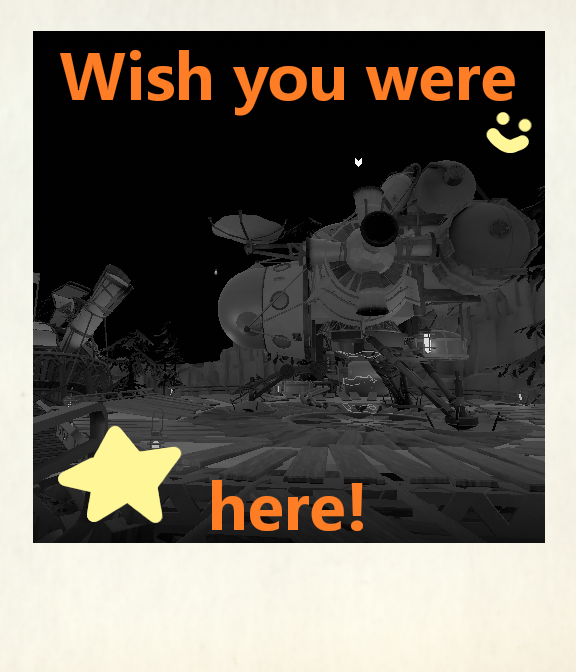
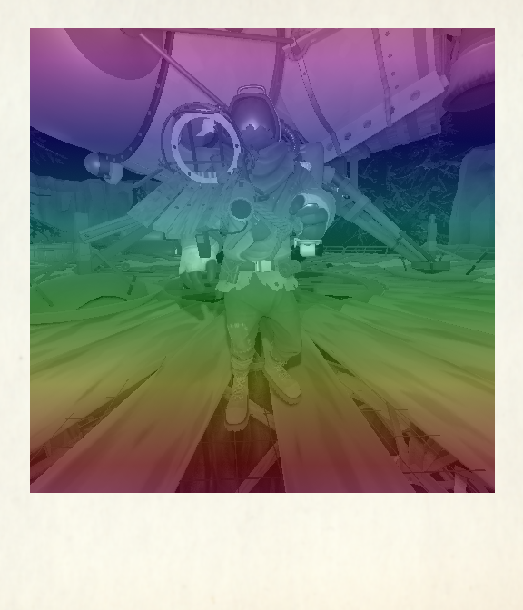
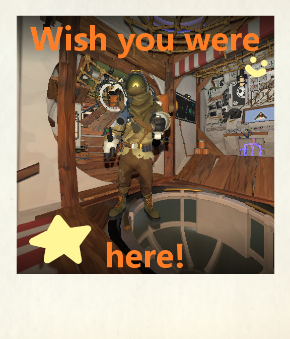
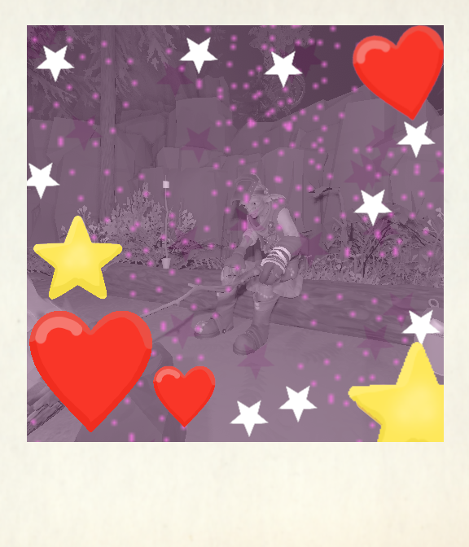

# Silly Filters
An Outer Wilds mod that adds silly filters/overlays to scout images.
Spice up your wild ventures!

## How to use
You can select which filter to use in the mod's settings. By default, the filter is set to `none` (no filter is applied).
Select a filter. Now you can take a picture with any scout!

Current filters include:
- `postcard`
- `rainbow`
- `so cute`
- `hearts`

## Compatability
This mod is compatable and has been tested with these scout image-related mods:
- [Outer Pictures](https://outerwildsmods.com/mods/outerpictures/)
- [Color Cameras](https://outerwildsmods.com/mods/colorcameras/)
- [Épicas Album](https://outerwildsmods.com/mods/picasalbum/)


This mod is **NOT** compatable with:
- [Scout Streaming](https://outerwildsmods.com/mods/scoutstreaming/)

Use Outer Pictures to download and save the scout photos (see examples below). Color photos can be taken with the Color Cameras Mod (also see below).

## Examples

<!--https://gist.github.com/DavidWells/7d2e0e1bc78f4ac59a123ddf8b74932d?permalink_comment_id=4536101#gistcomment-4536101-->
<p>




</p>


## Credit
Created by [MoonstoneStudios](https://github.com/MoonstoneStudios). 

Projects used and referenced:
- [Outer Wilds Mod Loader](https://github.com/ow-mods/owml) license: [MIT](https://github.com/ow-mods/owml/blob/e308381541bfe799fb4c8a401fee54bc5e2f9153/LICENSE)
- [Outer Wilds Mod Template](https://github.com/ow-mods/ow-mod-template) license: [MIT](https://github.com/ow-mods/ow-mod-template/blob/c1d95b11a3415b7f141482c9199890745cd63e77/LICENSE)
- [Outer Pictures](https://github.com/Pau318/OuterPictures) license: [MIT](https://github.com/Pau318/OuterPictures/blob/d45bb855cdb11c8f6a9ab834b16c89e634021f52/LICENSE)
- [Treating a 1D data structure as 2D grid answer on stack exchange](https://softwareengineering.stackexchange.com/a/212813) license: [CC BY-SA 4.0](https://creativecommons.org/licenses/by-sa/4.0/)
- [Alpha Compositing](https://en.wikipedia.org/wiki/Alpha_compositing) algorithm provided by Wikipedia.

## License
See also [LICENSE.md](LICENSE.md)

```
MIT License

Copyright (c) 2023 Owen H.

Permission is hereby granted, free of charge, to any person obtaining a copy
of this software and associated documentation files (the "Software"), to deal
in the Software without restriction, including without limitation the rights
to use, copy, modify, merge, publish, distribute, sublicense, and/or sell
copies of the Software, and to permit persons to whom the Software is
furnished to do so, subject to the following conditions:

The above copyright notice and this permission notice shall be included in all
copies or substantial portions of the Software.

THE SOFTWARE IS PROVIDED "AS IS", WITHOUT WARRANTY OF ANY KIND, EXPRESS OR
IMPLIED, INCLUDING BUT NOT LIMITED TO THE WARRANTIES OF MERCHANTABILITY,
FITNESS FOR A PARTICULAR PURPOSE AND NONINFRINGEMENT. IN NO EVENT SHALL THE
AUTHORS OR COPYRIGHT HOLDERS BE LIABLE FOR ANY CLAIM, DAMAGES OR OTHER
LIABILITY, WHETHER IN AN ACTION OF CONTRACT, TORT OR OTHERWISE, ARISING FROM,
OUT OF OR IN CONNECTION WITH THE SOFTWARE OR THE USE OR OTHER DEALINGS IN THE
SOFTWARE.
```